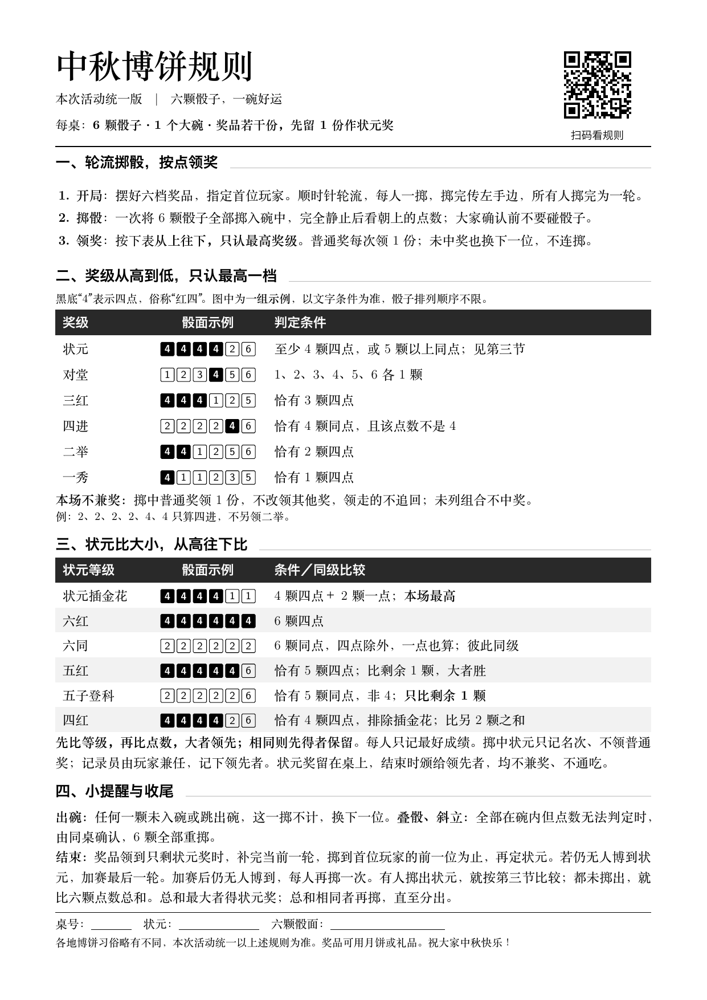
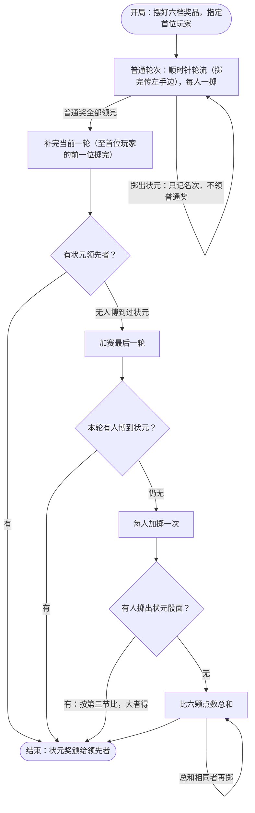

  
  <h1>中秋博饼规则</h1>

  
  
  
  
  

  
<em>一张规则纸，开一桌中秋博饼。</em>

  
<a href="https://www.luochang.ink/bobing-game/">🌐 在线讲解页</a> · <a href="output/pdf/rules-paper.pdf">📄 规则 PDF</a> · <a href="#快速开始">快速开始</a> · <a href="#本地开发">本地开发</a>

---

## ✨ 项目介绍

为中秋活动准备的一套博饼规则物料：**A4 黑白规则纸、网页讲解和规则验证脚本**。打印一张纸，备好六颗骰子、一个大碗和奖品，就能开局。

- **打印即用**：玩法步骤、奖级对照、状元比较和掷骰提醒都在一张 A4 纸上，附桌号与状元记录栏。
- **方便讲解**：网页提供骰面示例和常见疑问，适合活动前熟悉玩法。
- **规则明确**：写清不兼奖、不降档、同级比较与结束方式，减少现场争议。
- **可验证、可修改**：LaTeX 源稿配套 Python 状态机，修订依据记录在文档中。

> [!NOTE]
>
> 本稿是**本次活动统一版**。各地博饼习俗存在差异，奖级排序、兼奖、平局与结束方式均为本场约定，不作为各地通行的传统规则。网页用于解释与举例，以现场纸质规则为准。

## 🚀 快速开始

1. 下载 [博饼规则 PDF](output/pdf/rules-paper.pdf)，按 **A4 纵向、实际大小（100%）、黑白** 打印。
2. 每桌准备以下物料，按六档摆好奖品。
3. 指定首位玩家，由一位玩家兼任记录员。顺时针轮流掷骰，掷完传左手边。

规则纸右上角印有二维码，扫码即可在手机上阅读[讲解版规则](https://www.luochang.ink/bobing-game/)，方便同桌同时查看。

| 物料 | 每桌数量 |
| --- | --- |
| 规则纸 | 1 张 |
| 骰子 | 6 颗 |
| 大碗 | 1 个 |
| 奖品 | 按所用版本准备（classic：63 份；flexible：若干份，先留 1 份作状元奖），可用月饼或小礼品 |

  
📄 展开查看规则纸预览

  

    
  

## 🎲 规则速览

一次将六颗骰子全部掷入碗中，静止后看朝上的点数。**从上往下，只认最高奖级**；未列组合不中奖，未中奖也换下一位。

| 奖级 | 判定条件 | 奖品份数 |
| --- | --- | --- |
| 状元 | 至少 4 颗四点，或 5 颗以上同点 | 1 |
| 对堂 | 1、2、3、4、5、6 各 1 颗 | 2 |
| 三红 | 恰有 3 颗四点 | 4 |
| 四进 | 恰有 4 颗同点，且该点数不是 4 | 8 |
| 二举 | 恰有 2 颗四点 | 16 |
| 一秀 | 恰有 1 颗四点 | 32 |

份数为 classic 版的固定配置；flexible 版奖品若干、掷中普通奖领 1 份，数量以现场为准。判定条件各版本一致。

**领奖约定**：不兼奖、不通吃。掷中按最高奖级领奖，不改领其他奖；普通奖不追回。掷中状元只记名次、不领普通奖，状元奖在结束时颁给领先者。

**状元排序**：插金花 > 六红 > 六同（非四点，含六个 1，彼此同级）> 五红 > 五子登科 > 四红。五红与五子只比剩余 1 颗，四红比另 2 颗之和。先比等级、再比点数，大者领先，相同则先得者保留，每人只记最好成绩。具体骰面见 [规则纸第三节](output/pdf/rules-paper.pdf)。

**掷骰提醒**：任何一颗出碗，这一掷不计，换下一位。全部在碗内但叠骰、斜立无法判读时，由同桌确认后，六颗全部重掷。

**结束方式**：普通奖发完后补完当前一轮（classic 为 62 份领完；flexible 为奖品领到只剩预留的状元奖），有状元领先者即结束；仍无人博到状元则加赛最后一轮。加赛后仍无人博到，才每人再掷一次：掷出状元的按规则纸第三节比，都未掷出则比六颗点数总和，最大者得状元奖，总和相同者再掷，直至分出。

🔀 展开查看游戏流程图

## 🧭 版本

规则纸按活动场景分版本维护：仓库根的 `current` 指针决定 `make pdf` 编译哪个版本、网站渲染哪个版本，`output/pdf/rules-paper.pdf` 永远是当前版本。每个版本自含完整源稿（不做共享模板），各版本必须一致的规则段落由 CI 强制比对。

| 版本 | 定位 |
| --- | --- |
| [classic](versions/classic/) | 标准 63 份：固定奖品六档，单桌多桌通用，无全场环节 |
| [grand-final](versions/grand-final/) | 王中王：固定 63 份，各桌状元晋级全场“状元王”加赛 |
| [flexible](versions/flexible/) | 灵活奖品：奖品若干、先留 1 份作状元奖，单桌多桌通用，无全场环节 |
| [flexible-grand-final](versions/flexible-grand-final/) | 灵活奖品 · 王中王：奖品若干，各桌状元晋级全场“状元王”加赛 |

当前编译与网站渲染哪个版本，由仓库根 `current` 指针决定（内容一行版本名），本表刻意不固定标注：切换只需把 `current` 改为目标版本、`make pdf` 后提交，网站随部署自动更新。新增版本的要求见 [AGENTS.md](AGENTS.md) 的版本模型。

## 🔧 本地开发

直接使用规则纸可下载现成 PDF，无需准备开发环境。想自己动手时，各环节只需一条命令：

- **编译规则纸**：仓库根目录运行 `make pdf`（编译 `current` 指向的版本），依赖 MacTeX 与 macOS 字体（Songti SC / Hiragino Sans GB）；`make pdf-all` 把全部版本各编一遍供检查。
- **启动讲解网页**：在 `site/` 目录运行 `npm install && npm run dev`，技术栈为 Astro + Tailwind。
- **机器验证**：仓库根目录运行 `python3 scripts/state_machine.py` 与 `python3 scripts/version_consistency.py`，均仅依赖 Python 3 标准库。

依赖安装、预览与二维码核查、构建部署等完整步骤，见 [docs/local-dev-and-verification.md](docs/local-dev-and-verification.md)。

## 📂 项目结构

| 路径 | 说明 |
| --- | --- |
| [current](current) | 版本指针，一行版本名；决定编译与网站渲染的版本 |
| [versions/](versions/) | 版本仓库，每版自含源稿、说明（含特征句）与网页文案 |
| [output/pdf/rules-paper.pdf](output/pdf/rules-paper.pdf) | 唯一交付 PDF，永远 = current 指向的版本，由 `make pdf` 生成 |
| [site/](site/) | 讲解网页，构建时按指针渲染当前版本，含骰面示例与常见疑问 |
| [scripts/state_machine.py](scripts/state_machine.py) | 规则状态机与验证脚本 |
| [scripts/version_consistency.py](scripts/version_consistency.py) | 各版本规则纸共享段落一致性检查 |
| [scripts/paper_output_check.py](scripts/paper_output_check.py) | PDF 单页、底部安全线、预览渲染与二维码解码核查 |
| [scripts/web_reading_check.py](scripts/web_reading_check.py) | 讲解页浏览器回归检查（Playwright，七种视口 × 两引擎） |
| [docs/rule-audit.md](docs/rule-audit.md) | 资料来源、修订原因与验证记录 |
| [docs/local-dev-and-verification.md](docs/local-dev-and-verification.md) | 编译、预览核查、网页开发与机器验证的运行手册 |
| [docs/assets/](docs/assets/) / [docs/preview.png](docs/preview.png) | README 头图与规则纸预览 |
| [Makefile](Makefile) / [.latexmkrc](.latexmkrc) | 编译配置，中间产物按版本集中到 `build/<版本>/` |
| [.github/workflows/](.github/workflows/) | 规则检查与网页部署 |
| [AGENTS.md](AGENTS.md) | 仓库协作约定（版本模型、四件套、硬性约束） |

## 💡 如何贡献

发现措辞歧义、排版问题，或想改善讲解内容，可以提交 [Issue](https://github.com/luochang212/bobing-game/issues) 或 Pull Request。报告规则问题时，请附上具体的六颗骰面、当前场景和预期处理方式。

修改规则需同步完成：

1. 修改 LaTeX 源稿，并同步状态机与受影响的验证剧本。
2. 在 `docs/rule-audit.md` 记录修改原因；更新受影响的 README 流程图与网页举例。
3. 运行 `make pdf` 和[完整验证](docs/local-dev-and-verification.md#机器验证)，确认 PDF 仍为 **1 页**，内容最低点 **yMax ≤ 806pt**，并抽查 PDF 中的新措辞。

规则纸保持黑白灰阶与单页约束，新增内容前先看 [AGENTS.md](AGENTS.md) 的版面约定。

## 📜 开源协议

[MIT](LICENSE)
