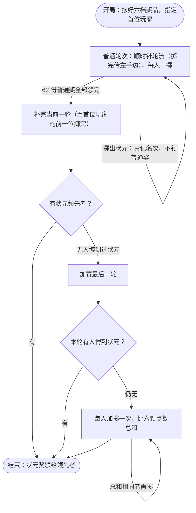

# 中秋博饼规则

一份用于中秋活动现场的 A4 黑白单页规则纸，包含玩法步骤、黑白骰面示例、奖级表、状元比较、异常与结束规则，以及桌号和状元记录栏。

## 文件

- `博饼规则-A4黑白.tex`：可编辑的 LaTeX 源稿。
- `output/pdf/博饼规则-A4黑白.pdf`：可直接打印的 PDF。
- `.latexmkrc`：默认使用 XeLaTeX，编译中间文件集中在 `build/`。
- `Makefile`：编译并复制最终 PDF。
- `docs/规则核查.md`：资料依据、旧稿问题与新版采用的约定。
- `verify/状态机验证.py`：规则状态机的自动化验证（全枚举、确定性剧本、随机整局模拟），`python3 verify/状态机验证.py` 运行，仅依赖标准库。
- `build/`：编译产物；`build/previous/` 保存整理前的失败编译记录。

## 本机生成

使用本机已安装的 MacTeX / TeX Live、`latexmk`、`make`，以及 macOS 的 `Songti SC` 和 `Hiragino Sans GB` 字体，不需要联网下载资源。

```sh
make pdf
```

请使用 XeLaTeX 编译；pdfLaTeX 不支持源稿使用的系统字体设置。如果终端找不到 TeX 命令，可先执行 `export PATH="/Library/TeX/texbin:$PATH"`。

打印时选择 A4 纵向、实际大小（100%）和黑白打印。

## 游戏流程

图与 `verify/状态机验证.py` 的实现一一对应。“比总和”阶段按现行规则纸绘制；该阶段若遇真状元骰面属未定义角落，见 `docs/规则核查.md` 的“状态机验证”一节。



## 内容说明

新版参考原稿和本机 WorkBuddy 目录中的规则稿，采用方框数字骰面示例，明确标注为“本次晚会统一版”。各地特殊玩法不同，下列安排是本场约定：

- 状元由高到低：插金花、六红、六同（非四点，含六个 1）、五红、五子、四红。
- 五红与五子同级时比较剩余一颗；四红比较另外两颗之和；六同彼此同级。比较结果相同，先得者保留，每人只记最好成绩。
- 每次只按最高奖级领奖，不兼奖、不降档、不通吃，普通奖不追回；状元奖结束时发放。
- 出碗本次无效，换下一位；全部在碗内但叠骰、斜立无法判读时，六颗全部重掷。
- 普通奖发完后完成当前一轮；若尚无状元，加赛最后一轮，仍无则每人加掷一次比六颗点数总和定状元。

当前版本按奖品发完结束，没有设置时间上限。源稿可直接修改，再运行 `make pdf`；打印前确认输出仍为一页。
