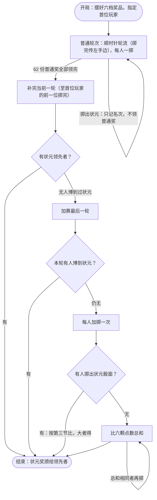

<div align="center">
  
  <h1>中秋博饼规则</h1>
</div>

<div align="center">
  <a href="https://github.com/luochang212/bobing-game/stargazers"></a>
  <a href="https://github.com/luochang212/bobing-game/forks"></a>
  <a href="https://github.com/luochang212/bobing-game/actions/workflows/verify.yml"></a>
  <a href="output/pdf/博饼规则-A4黑白.pdf"></a>
  <a href="LICENSE"></a>
</div>

<div align="center">
  <p><em>一张规则纸，开一桌中秋博饼。</em></p>
  <p><a href="https://www.luochang.ink/bobing-game/">🌐 在线讲解页</a> · <a href="output/pdf/博饼规则-A4黑白.pdf">📄 下载规则 PDF</a> · <a href="#快速开始">快速开始</a> · <a href="#本地开发">本地开发</a></p>
</div>

---

## ✨ 项目介绍

为中秋活动准备的一套博饼规则物料：**A4 黑白规则纸、网页讲解和规则验证脚本**。打印一张纸，备好六颗骰子、一个大碗和 63 份奖品，就能开局。

- **打印即用**：玩法步骤、奖级对照、状元比较和掷骰提醒都在一张 A4 纸上，附桌号与状元记录栏。
- **方便讲解**：网页提供骰面示例和常见疑问，适合活动前熟悉玩法。
- **规则明确**：写清不兼奖、不降档、同级比较与结束方式，减少现场争议。
- **可验证、可修改**：LaTeX 源稿配套 Python 状态机，修订依据记录在文档中。

> [!NOTE]
>
> 本稿是**本次活动统一版**。各地博饼习俗存在差异，奖级排序、兼奖、平局与结束方式均为本场约定，不作为各地通行的传统规则。网页用于解释与举例，以现场纸质规则为准。

<a id="快速开始"></a>

## 🚀 快速开始

1. 下载 [博饼规则 PDF](output/pdf/博饼规则-A4黑白.pdf)，按 **A4 纵向、实际大小（100%）、黑白** 打印。
2. 每桌准备以下物料，按六档摆好奖品。
3. 指定首位玩家，由一位玩家兼任记录员。顺时针轮流掷骰，掷完传左手边。

规则纸右上角印有二维码，扫码即可在手机上阅读[讲解版规则](https://www.luochang.ink/bobing-game/)，方便同桌同时查看。

| 物料 | 每桌数量 |
| --- | --- |
| 规则纸 | 1 张 |
| 骰子 | 6 颗 |
| 大碗 | 1 个 |
| 奖品 | 63 份，可用月饼或小礼品 |

<details>
  <summary>📄 展开查看规则纸预览</summary>
  <p align="center">
    <a href="output/pdf/博饼规则-A4黑白.pdf"></a>
  </p>
</details>

## 🎲 规则速览

一次将六颗骰子全部掷入碗中，静止后看朝上的点数。**从上往下，只认最高奖级**；未列组合不中奖，未中奖也换下一位。

| 奖级 | 判定条件 | 奖品份数 |
| --- | --- | --- |
| 状元 | 至少 4 颗四点，或 5 颗以上同点 | 1 |
| 对堂 | 1、2、3、4、5、6 各 1 颗 | 2 |
| 三红 | 恰有 3 颗四点 | 4 |
| 四进 | 恰有 4 颗同点，且该点数不是 4 | 8 |
| 二举 | 恰有 2 颗四点 | 16 |
| 一秀 | 恰有 1 颗四点 | 32 |

**领奖约定**：不兼奖、不降档、不通吃。所掷奖级发完就空过，不改领其他奖；普通奖不追回。掷中状元只记名次、不领普通奖，状元奖在结束时颁给领先者。

**状元排序**：插金花 > 六红 > 六同（非四点，含六个 1，彼此同级）> 五红 > 五子登科 > 四红。五红与五子只比剩余 1 颗，四红比另 2 颗之和。先比等级、再比点数，大者领先，相同则先得者保留，每人只记最好成绩。具体骰面见 [规则纸第三节](output/pdf/博饼规则-A4黑白.pdf)。

**掷骰提醒**：任何一颗出碗，这一掷不计，换下一位。全部在碗内但叠骰、斜立无法判读时，由同桌确认后，六颗全部重掷。

**结束方式**：62 份普通奖发完后补完当前一轮，有状元领先者即结束；仍无人博到状元则加赛最后一轮。加赛后仍无人博到，才每人再掷一次：掷出状元的按规则纸第三节比，都未掷出则比六颗点数总和，最大者得状元奖，总和相同者再掷，直至分出。

<details>
<summary>🔀 展开查看游戏流程图</summary>



</details>

<a id="本地开发"></a>

## 🛠️ 本地开发

直接使用规则纸可下载现成 PDF。需要修改排版或网页时，再准备对应的开发环境。

| 用途 | 技术与依赖 |
| --- | --- |
| 规则纸排版 | LaTeX、MacTeX（latexmk + XeLaTeX）、macOS 字体 |
| 讲解网页 | Astro、Tailwind CSS、Node.js 与 npm |
| 规则验证 | Python 3，仅依赖标准库 |
| PDF 预览与二维码核查 | Poppler、Python 3 + Pillow / ZXing-C++ |
| 网页回归检查 | Python 3 + Playwright（Chromium / WebKit） |
| 自动检查与部署 | GitHub Actions、Poppler、GitHub Pages |

### 编译规则纸

在仓库根目录运行：

```sh
make pdf
```

依赖 macOS 字体 **Songti SC / Hiragino Sans GB**。编译中间产物集中在 `build/`，最终 PDF 输出到 [`output/pdf/博饼规则-A4黑白.pdf`](output/pdf/博饼规则-A4黑白.pdf)。

<details>
<summary>找不到 TeX 命令？</summary>

安装 MacTeX 后，将工具目录加入当前终端的 PATH，再编译：

```sh
export PATH="/Library/TeX/texbin:$PATH"
make pdf
```

本稿使用 XeLaTeX，pdfLaTeX 不支持当前字体设置。请统一通过 `make pdf` 编译。

</details>

### 生成预览与核查二维码

二维码地址直接写在 TeX 的 `\qrcode` 命令中，由 MacTeX 自带宏包生成矢量图。改地址后运行 `make pdf`，再用[输出验证脚本](verify/规则纸输出验证.py)检查并更新预览。

首次准备核查环境：

```sh
brew install poppler
python3 -m venv tmp/pdf-tools
tmp/pdf-tools/bin/pip install pillow zxing-cpp
```

每次编译后运行：

```sh
tmp/pdf-tools/bin/python verify/规则纸输出验证.py --preview-output docs/preview.png
```

脚本检查单页与 806pt 底部安全线，在 `tmp/pdf-review/` 生成提取文字及 100、150、300 DPI 图片，并逐张解码二维码，核对目标地址。全部通过后才更新 README 预览。纯排版修改时可附加 `--compare-ref <提交号>`，对照该版本的规则正文；更换网址时同时传入 `--url <新地址>`。核查依赖不参与 PDF 编译。

### 启动讲解网页

```sh
cd site
npm install
npm run dev
```

打开终端显示的本地地址，访问 `/bobing-game/` 路径。构建与预览：

```sh
npm run build
npm run preview
```

产物位于 `site/dist/`。[部署工作流](.github/workflows/site.yml) 配置为在 `main` 分支的 `site/**` 或工作流文件变化时部署到 GitHub Pages，也支持手动触发，线上地址为 [www.luochang.ink/bobing-game](https://www.luochang.ink/bobing-game/)。部署时会将规则纸复制为 `rules-paper.pdf`；本地预览构建产物时，如需使用页面上的 PDF 下载入口，可先在 `site/` 目录执行：

```sh
cp ../output/pdf/博饼规则-A4黑白.pdf dist/rules-paper.pdf
```

## ✅ 机器验证

在仓库根目录运行：

```sh
python3 verify/状态机验证.py
```

| 检查层级 | 覆盖内容 |
| --- | --- |
| 全枚举 | 46656 种骰面归类 |
| 确定性剧本 | 19 项，覆盖奖品发完、状元比较、先得者保留、补轮反超与结束边界 |
| 随机整局 | 修订前对照与现行结束条款各 10000 局，检查终止情况、库存守恒与路径分布 |

<details>
<summary>查看验证输出节选</summary>

```text
[1] 全枚举 46656 种骰面归类唯一、无遗漏 ✓
[2] 确定性剧本 19 项，失败 0 项
[3] 字面规则随机 10000 局全部终止（最长 832 掷）
[4] 拟修订规则随机 10000 局全部终止（最长 824 掷）
```

脚本保留历史命名：`sum_phase_mode='proposed'` 对应规则纸现行结束条款，`literal` 为修订前对照。随机模拟全部结束是观测结果；普通奖阶段和总和同分重掷为概率 1 终止，不保证固定掷骰次数内结束。

</details>

[验证工作流](.github/workflows/verify.yml) 在推送到 `main` 和提交 PR 时运行状态机检查，并用 Poppler 检查已提交 PDF 的单页与版面红线。PDF 编译依赖本机字体，仍需在本机完成。

手机阅读体验另有[核查记录与浏览器回归检查](docs/移动端阅读核查.md)，覆盖首屏玩法、规则字号、目录跳转与无脚本阅读。

## 📂 项目结构

| 路径 | 说明 |
| --- | --- |
| [博饼规则-A4黑白.tex](博饼规则-A4黑白.tex) | 规则纸唯一源稿，规则语义以它为准 |
| [output/pdf/博饼规则-A4黑白.pdf](output/pdf/博饼规则-A4黑白.pdf) | 唯一交付 PDF，由 `make pdf` 生成 |
| [site/](site/) | 讲解网页，含骰面示例与常见疑问 |
| [verify/状态机验证.py](verify/状态机验证.py) | 规则状态机与验证脚本 |
| [verify/规则纸输出验证.py](verify/规则纸输出验证.py) | PDF 单页、底部安全线、预览渲染与二维码解码核查 |
| [verify/网页阅读验证.py](verify/网页阅读验证.py) | 讲解页浏览器回归检查（Playwright，七种视口 × 两引擎） |
| [docs/规则核查.md](docs/规则核查.md) | 资料来源、修订原因与验证记录 |
| [docs/assets/](docs/assets/) / [docs/preview.png](docs/preview.png) | README 头图与规则纸预览 |
| [Makefile](Makefile) / [.latexmkrc](.latexmkrc) | 编译配置，中间产物集中到 `build/` |
| [.github/workflows/](.github/workflows/) | 规则检查与网页部署 |
| [AGENTS.md](AGENTS.md) | 仓库协作约定 |

## 💡 如何贡献

发现措辞歧义、排版问题，或想改善讲解内容，可以提交 [Issue](https://github.com/luochang212/bobing-game/issues) 或 Pull Request。报告规则问题时，请附上具体的六颗骰面、当前场景和预期处理方式。

修改规则需同步完成：

1. 修改 LaTeX 源稿，并同步状态机与受影响的验证剧本。
2. 在 `docs/规则核查.md` 记录修改原因；更新受影响的 README 流程图与网页举例。
3. 运行 `make pdf` 和完整验证，确认 PDF 仍为 **1 页**，内容最低点 **yMax ≤ 806pt**，并抽查 PDF 中的新措辞。

规则纸保持黑白灰阶。当前内容底部约 795pt，新增文字前需考虑单页空间；完整约定见 [AGENTS.md](AGENTS.md)。

## 📜 开源协议

[MIT](LICENSE)
